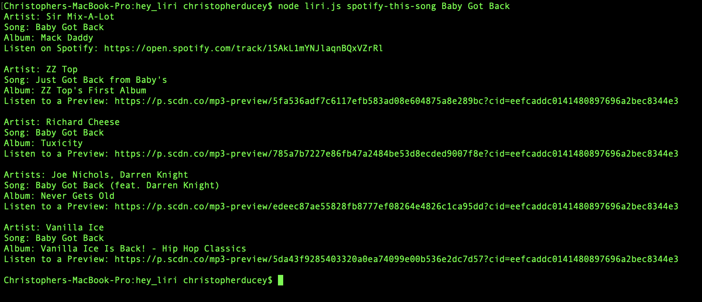

# LIRI Bot

LIRI Bot is a node cli app that takes in parameters from the command line and uses those to make API calls to various services to get information and return it back for you by printing it out to the console.  

## Getting Started

### Prerequisites

1.  Spotify API Key
    * Needed for the node-spotify-api module for making calls to the Spotify API
    * Visit <https://developer.spotify.com/my-applications/#!/> to sign-up (you can use your existing Spotify account or  create a new one)
    * Copy the values down for the client id and client secret from an application you register.  These will be used later.

2.  Node installed on your local machine

### Installing

Follow the instructions in this section to get the app setup to run on your machine.

1.  Clone the git project to your machine (example below is using ssh)
    ``` bash
    git clone git@github.com:chrisducey01/hey_liri.git
    ```

2.  Install the node module dependencies from the package.json file
    ``` bash
    npm install
    ```

3.  Create a .env file in the top level directory.  This will contain the Spotify API keys you created in the Prerequisites section.
* The contents of the .env file should look similar to below (replace everything to the right of the equals sign, including the carats <>):
    ```
    # Spotify API keys

    SPOTIFY_ID=<Replace with your spotify id>
    SPOTIFY_SECRET=<Replace with your spotify secret>
    ```

## Running the app

The app is executed on the command line using node.  You will pass node the `liri.js` file and parameters that will control what **LIRI Bot** will do.

### Usage
The syntax for calling the **LIRI Bot** on the command line is below:
``` bash
node liri.js <Action to perform> <Thing to search for>
```

### LIRI Actions
The **LIRI Bot** can be called to do any of the actions in this section.

1. Search for upcoming events for a band using Bands In Town
    ```
    node liri.js concert-this Billie Eilish
    ```
    

2.  Search for song information on Spotify
    ```
    node liri.js spotify-this-song Baby Got Back
    ```
    

3.  Search for movie information using OMDB
    ```
    node liri.js movie-this Tommy Boy
    ```
    

4.  Search using the contents of a file instead of passing as command line parameters
    ```
    node liri.js do-what-it-says
    ```
    

    * **Note:**  In order for this to work, you need to include the parameters you would normally pass on the command line in the `random.txt` file in the base directory.  This file should only have one line and look similar to the example below:
        ```
        spotify-this-song,"I Want it That Way"
        ```

## Authors

* **Christopher Ducey** - *Initial work* - [chrisducey01](https://github.com/chrisducey01)
